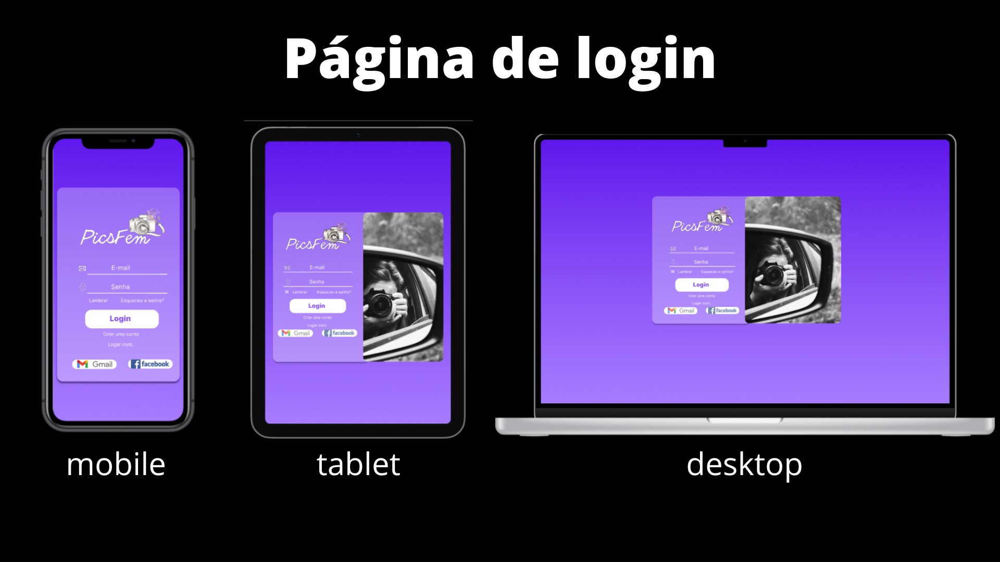
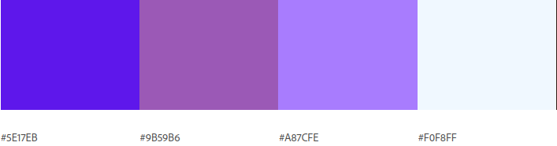
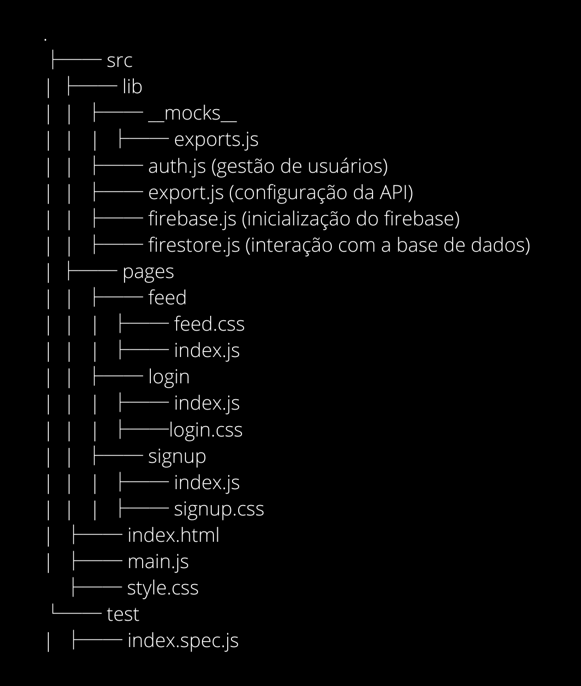

    

  # PicsFem: sua comunidade feminina de fotografia
  
  

  
  
  
  
  
   
   
  

   
  
  **Status do Projeto:** _Concluído_ 

  Confira o resultado do projeto [aqui](https://amanda-holanda.github.io/SAP008-social-network/) ou no QR code a seguir:

     
  

## Índice

* [1. Resumo do projeto](#1-resumo-do-projeto)
* [2. Definição de produto](#2-definição-de-produto)
* [3. Pesquisas de usuário](#3-pesquisas-de-usuário)
* [4. Histórias de usuário](#4-histórias-de-usuário)
* [5. Desenho da Interface de Usuário](#5-desenho-da-interface-de-usuário)
  * [5.1 Protótipo de baixa fidelidade](#51-protótipo-de-baixa-fidelidade)
  * [5.2 Protótipos de alta fidelidade](#52-protótipos-de-alta-fidelidade)
* [6. Testes manuais e de usabilidade](#6-testes-manuais-e-de-usabilidade)
* [7. Considerações Técnicas](#7-considerações-técnicas)
  * [7.1 Boilerplate](#71-boilerplate)
  * [7.2 Planejamento](#72-planejamento)
  * [7.3 Ferramentas utilizadas](#73-ferramentas-utilizadas)
  * [7.4 Tech Skills](#74-tech-skills)
* [8. Sobre as Desenvolvedoras](#8-sobre-as-desenvolvedoras)

***

## 1. Resumo do projeto

O projeto Social Network foi o terceiro projeto desenvolvido no bootcamp da [Laboratoria](https://www.laboratoria.la/br). O seu principal objetivo era construir uma rede social que permitisse à qualquer usuário criar uma conta de acesso, logar-se com ela, criar, editar, deletar e dar *likes* em publicações. Além disso, a aplicação deveria ser construída com múltiplas telas em Vanilla JavaScript. 

A partir disso, construiu-se a PicsFem: uma rede social desenvolvida para mulheres amantes de fotografia. O seu objetivo principal é construir uma comunidade segura para que mulheres que amam fotografia possam: compartilhar conhecimentos e dicas; se apoiar; aperfeiçoar técnicas; além de debater e sanar dúvidas técnicas e não técnicas sobre o tema.

Neste projeto, desenvolvemos habilidades sobre autenticação com Firebase Auth, persistência de dados com Firestore e encaminhamento (rotas) de páginas ou componentes, e fomos apresentadas ao conceito de SPA (Single Page Application).

## 2. Definição de produto

PicsFem é uma rede social desenvolvida para mulheres amantes de fotografia. O seu objetivo principal é construir uma comunidade segura para que essas mulheres possam compartilhar conhecimento e ideias sobre o tema, além de poderem alavancar suas carreiras no mercado de fotografia, que ainda é marjoritariamente masculino.

Denominamos as usuárias de *"picfemers"* com o objetivo de torná-las mais conectadas com a comunidade e para que se sintam, ainda mais, pertecentes à rede.

De acordo com pesquisas realizadas durante o desenvolvimento do projeto, relatou-se que mulheres fotógrafas possuem um grande desafio para adentrar no mercado de fotografia, pois este ainda é marjoritariamente masculino. Diante disso, uma das futuras funcionalidades da rede social será a possibilidade de clientes poderem contratar mulheres fotógrafas para trabalhos freelancers através da PicsFem.

## 3. Pesquisas de usuário

Um dos objetivos de aprendizagem do projeto foi realizar entrevistas com os possíveis usuários. Para isso, utilizamos um [form do google docs](https://docs.google.com/forms/d/1FlFCNkErX05Q27g_a5mqbExRpl5cPdRpPk-WEPT3eRA/viewform?hl=pt-br&hl=pt-br&edit_requested=true#responses) como ferramenta e neste criamos um formulário para compreender o perfil dos nossos possíveis usuários e analisar suas necessidades.

A priori, precisávamos conhecer o nosso público. Logo, iniciamos o questionário com perguntas como: nome, idade e como o usuário se identifica como pessoa. Dessa forma, foi identificado que nosso público seria majoritariamente feminino e em idades diversas.

Após a primeira identificação de nosso usuário, buscamos entender o seu perfil em relação ao propósito do site e a sua configuração pessoal, já que a aplicação web construída é voltada para o público amante de fotografia. Portanto, analisou-se as características vigentes e os possíveis interesses em utilizar o produto. Além disso, coletou-se: temas de interesse, relatos visando uma melhor usabilidade do produto e sugestões de possíveis implementações futuras.

A pesquisa de usuário foi muito importante para o direcionamento do desenvolvimento do projeto, além de nos dar uma melhor visão para implementações futuras na rede social, mediante possíveis investimentos.

## 4. Histórias de usuário

Após compreender melhor as necessidades de nossas usuárias, determinamos as Histórias de Usuário, que representam o que elas precisam na Rede Social.

### História de usuário 1: 
> "Como usuária, eu gostaria de fazer o login utilizando a minha conta do google, com o objetivo de otimizar o meu tempo."

* **Critérios de aceitação:**
  * página de login
  * página de cadastro

* **Definição de pronto:**
  * A história implementada foi testada com, pelo menos, 3 usuários e foram incorporados os melhoramentos necessários identificados nos testes de usabilidade
  * Finalizou-se a SPA (Single Page Application)
  * A página de login estava responsiva para todas as telas
  * Construiu-se o teste da função de logar com o google
  * Recebeu-se o code review de pelo menos uma parceira de equipe
  * Realizou-se o deploy utilizando o git tag.

### História de usuário 2:
> "Eu, como entusiasta de fotografias, gostaria de publicar dicas sobre edição de fotos com o objetivo de compartilhar meus conhecimentos com a comunidade. Além disso, gostaria de editar ou removê-las depois, para melhorar a qualidade das publicações."

* **Critérios de aceitação:**
  * página de feed
  * fazer uma publicação no feed
  * editar uma publicação no feed
  * excluir uma publicação no feed  

* **Definição de pronto:**
  * A história implementada foi testada com, pelo menos, 3 usuários e foram incorporados os melhoramentos necessários identificados nos testes de usabilidade
  * Finalizou-se a SPA (Single Page Application)
  * A página de feed estava responsiva para todas as telas
  * Construiu-se o teste das funções de publicar, editar e excluir post
  * Recebeu-se o code review de pelo menos uma parceira de equipe
  * Realizou-se o deploy utilizando o git tag.

### História de usuário 3: 
> "Como PicsFemer, eu gostaria de interagir com as minhas outras colegas de comunidade através de likes, com o objetivo de me conectar melhor com elas."

* **Critérios de aceitação:**
  * conseguir dar like e deslike na publicação do feed 

* **Definição de pronto:**
  * Construiu-se o teste da função de dar like
  * Recebeu-se o code review de pelo menos uma parceira de equipe
  * Realizou-se o deploy utilizando o git tag.
  
### História de usuário 4: 
> "Como usuária de redes sociais, gostaria de poder sair da minha conta da PicsFem, com o objetivo de não deixar tantas contas de redes sociais abertas ao mesmo tempo."

* **Critérios de aceitação:**
  * conseguir sair da conta  

* **Definição de pronto:**
  * Construiu-se o teste da função de sair da conta
  * Recebeu-se o code review de pelo menos uma parceira de equipe
  * Realizou-se o deploy utilizando o git tag.

## 5. Desenho da Interface de Usuário

### 5.1 Protótipo de baixa fidelidade

### 5.2 Protótipos de alta fidelidade

* **Os protótipos de alta fidelidade foram desenvolvidos no Figma. Você pode conferír:**
  * O protótipo versão mobile [aqui](https://www.figma.com/proto/OSJoeXuZEyurDaYglNHfb0/PicsFem?node-id=81%3A74&scaling=scale-down&page-id=84%3A2&starting-point-node-id=84%3A52&show-proto-sidebar=1);
  * O protótipo versão tablet [aqui](https://www.figma.com/proto/OSJoeXuZEyurDaYglNHfb0/PicsFem?node-id=120%3A3&scaling=scale-down&page-id=120%3A2&starting-point-node-id=120%3A3&show-proto-sidebar=1);
  * O protótipo versão desktop [aqui](https://www.figma.com/proto/OSJoeXuZEyurDaYglNHfb0/PicsFem?node-id=6%3A7&scaling=scale-down&page-id=0%3A1&starting-point-node-id=6%3A7&show-proto-sidebar=1);
  
* **Ou você pode conferí-los nas imagens a seguir:**
  
  
  

* **Paleta de cores escolhida:**

  

## 6. Testes manuais e de usabilidade

Após fazermos os testes manuais e de usabilidade, incorporamos os feedbacks dados pelos usuários, e fizemos as seguintes mudanças:

#### 6.1. Tiramos a fotografia do layout da página de login da versão para tablets, pois o usuário relatou que o formulário não ficava tão legível, já que a imagem achatava o seu design.

#### 6.2. Colocamos o botão de voltar no formulário de criar conta, pois o usuário relatou que sentiu dificuldade em retornar para a página anterior, além de não ter ficado claro para ele como retornava.

#### 6.3. Colocamos os botões de editar e excluir o post somente para as usuárias que publicaram o post.

#### 6.4. Inicialmente, as mensagens de erro estavam na cor vermelha e a usuária relatou que sentia dificuldade para visualizá-las. Por conta disso, colocamos o fundo das mensagens na cor amarela (cor complementar ao violeta), causando um efeito visual mais confortável para o(a) leitor(a).

## 7. Considerações Técnicas

O projeto foi desenvolvido somente em JavaScript (ES6), HTML e CSS. Ademais, não foi permitido o uso de bibliotecas e frameworks, apenas
vanilla JavaScript, com exceção da biblioteca Firebase para gestão de usuário e base de dados.

### 7.1 Boilerplate

Nosso _boilerplate_ foi organizado da seguinte forma:

### 7.2 Planejamento

Confira [aqui](https://trello.com/invite/b/cK1le3I9/cd45190169dbf0b4c6bec554e2b2a6d1/social-network) todo o nosso planejamento, que foi realizado utilizando a ferramenta **Trello**.

### 7.3. Ferramentas utilizadas

* Figma;
* Trello;
* Metroretro;
* Git;
* GitHub;
* Visual Studio Code;

### 7.4 Tech Skills

* HTML5;
* CSS3;
* JavaScript;
* Node.js;
* Responsividade (construção em mobile first);
* Jest;
* Firebase;
* SPA (Single Page Application);
* Web APIs;
* User-centricity;
* Product Design
* Research

## 8. Sobre as Desenvolvedoras
Projeto desenvolvido em equipe por: 
* Amanda Holanda: [Linkedin](https://www.linkedin.com/in/amandaholanda/) | [GitHub](https://github.com/amanda-holanda)
* Isabella Lima [Linkedin](https://www.linkedin.com/in/isa-bella-lima/) | [GitHub](https://github.com/Bellalimalima)
* Gleyciane Macena [Linkedin](https://www.linkedin.com/in/gleyciane-macena-costa/) | [GitHub](https://github.com/Gleyciane-Macena)
